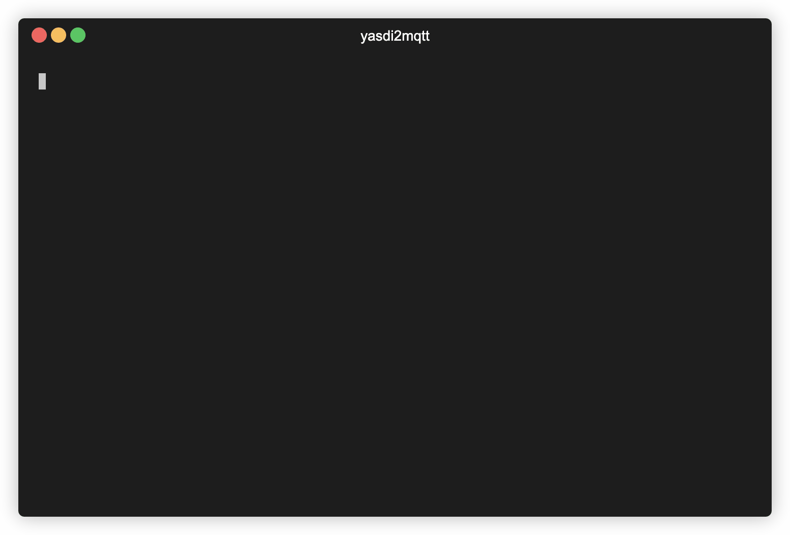

# yasdi2mqtt
[](https://hub.docker.com/r/pkwagner/yasdi2mqtt)
[](https://hub.docker.com/r/pkwagner/yasdi2mqtt)


`yasdi2mqtt` is an MQTT adapter for SMA inverters communicating over serial interface. It fetches spot values from attached devices in a fixed interval and publishes them via MQTT in JSON data format. Moreover, it also works with only a fraction of all inverters being online at the same time.



## Setup & Run
There are multiple ways to get `yasdi2mqtt` working. I'd strongly recommend using `docker-compose` or `docker` for setup. If you encounter any problems, feel free to open an issue!

By default YASDI is configured to use directly attached RS485 adapters. Further information on how to set up IP-based hardware instead can be found [here](https://github.com/pkwagner/yasdi2mqtt/issues/1) (German). To prevent permission problems, `yasdi2mqtt` runs as container root in all showcased scenarios. Therefore, consider creating an unprivileged user for production builds.

### Variant I: docker-compose
1. Check `yasdi.ini` configuration
    * The included blueprint is meant to be used with serial adapters, but IP-based communication should be possible as well (see YASDI reference)
2. Create empty `devices` directory
    * YASDI will use this folder as device cache, so you'll save the 1-2 minutes for device data download after second startup
3. Edit `docker-compose.yml` file
    * See table below for environmental variables (section `environment`)
    * Adjust serial adapter path (section `devices`) if not mapped to `/dev/ttyUSB0` or drop it for IP-based setup
4. `docker-compose up`
    * After starting up, `yasdi2mqtt` should immediately connect to your MQTT broker
    * Detected devices will be printed to console, the first MQTT message might take 1-2 minutes more because of device data download

### Variant II: docker
1. Check `yasdi.ini` configuration
    * The included blueprint is meant to be used with serial adapters, but IP-based communication should be possible as well (see YASDI reference)
2. Create empty `devices` directory
    * YASDI will use this folder as device cache, so you'll save the 1-2 minutes for device data download after second startup
3. Start container with following command:
```sh
docker run \
   --device /dev/ttyUSB0:/dev/ttyUSB0 \
   -v <project_dir>/devices:/etc/yasdi2mqtt/devices \
   -v <project_dir>/yasdi.ini:/etc/yasdi2mqtt/yasdi.ini:ro \
   -e YASDI_CONFIG="/etc/yasdi2mqtt/yasdi.ini" \
   -e YASDI_DRIVER_ID="0" \
   -e YASDI_MAX_DEVICE_COUNT="1" \
   -e YASDI_UPDATE_INTERVAL="30" \
   -e MQTT_TOPIC_PREFIX="/solar/inverter" \
   -e MQTT_SERVER="example.com" \
   -e MQTT_PORT="1883" \
   -e MQTT_USER="johndoe" \
   -e MQTT_PASSWORD="sEcReT" \
   pkwagner/yasdi2mqtt
```

### Variant III: Manual setup
1. Install [cJSON](https://github.com/DaveGamble/cJSON), other project's dependencies and build toolchain
   1. `sudo apt install git gcc make cmake openssl libssl-dev libcjson1 libcjson-dev` for Ubuntu-based distributions
2. Clone and install [Paho](https://github.com/eclipse/paho.mqtt.c.git)
    1. `make`
    2. `sudo make install`
3. Clone and install [log.c](https://github.com/rxi/log.c.git)
    1. `gcc -shared -fPIC -DLOG_USE_COLOR -o liblog_c.so src/log.c`
    2. `sudo cp liblog_c.so /usr/local/lib` to install system-wide
    3. `sudo cp src/*.h /usr/local/include` to make headers available system-wide
4. Clone and install [YASDI](https://github.com/konstantinblaesi/yasdi.git)
    1. `mkdir projects/generic-cmake/build-gcc`
    2. `cd projects/generic-cmake/build-gcc`
    3. `cmake -D YASDI_DEBUG_OUTPUT=0 ..`
    4. `make`
    5. `sudo make install`
5. Clone and install this repository
    1. `make YASDI_PATH=<yasdi_dir>`
    2. `sudo make YASDI_PATH=<yasdi_dir> install`
6. Check `yasdi.ini` configuration
    * The included blueprint is meant to be used with serial adapters, but IP-based communication should be possible as well (see YASDI reference)
7. Create empty `devices` directory
    * YASDI will use this folder as device cache, so you'll save the 1-2 minutes for device data download after second startup
8. Run `yasdi2mqtt` with required parameters (see `docker-entrypoint.sh` and compare with table below)
    * After starting up, `yasdi2mqtt` should immediately connect to your MQTT broker
    * Detected devices will be printed to console, the first MQTT message might take 1-2 minutes more because of device data download

### Debugging
If you stuck during setup, there are a few options you can check to make `yasdi2mqtt` more verbose. When using custom build settings, you always need to compile your own container with `docker build -t yasdi2mqtt .` afterwards.
* Enable debug output of `yasdi2mqtt` itself (see variable `LOG_LEVEL` in table below)
* Replace `YASDI_DEBUG_OUTPUT=0` by `YASDI_DEBUG_OUTPUT=1` in `Dockerfile` to activate `YASDI` debug output
    * When using manual setup method, replace parameter during YASDI install directly

### Environmental variables
> **Caution:** All configuration params below will be passed to `yasdi2mqtt` as program arguments. Therefore, especially the MQTT credentials will be exposed system-wide via process list. Keep this in mind when securing your MQTT access.

| Variable               | Description                                                                                                                                                                   | Example value             |
|------------------------|-------------------------------------------------------------------------------------------------------------------------------------------------------------------------------|---------------------------|
| YASDI_CONFIG           | Path to `yasdi.ini` file <br> *Inside container, shouldn't be changed therefore*                                                                                              | /etc/yasdi2mqtt/yasdi.ini |
| YASDI_DRIVER_ID        | ID of driver declared in `yasdi.ini` to use                                                                                                                                   | 0                         |
| YASDI_MAX_DEVICE_COUNT | Maximum number of devices being online at the same time                                                                                                                       | 1                         |
| YASDI_UPDATE_INTERVAL  | Time between value update requests in seconds <br> *Value update itself takes some time, so it shouldn't be lower than 15 from my experience*                                 | 30                        |
| MQTT_TOPIC_PREFIX      | MQTT messages will later be published to topic `$MQTT_TOPIC_PREFIX/<device_sn>`                                                                                               | solar/inverter            |
| MQTT_SERVER            |                                                                                                                                                                               | example.com               |
| MQTT_PORT              |                                                                                                                                                                               | 1883 (8883 if you use SSL)|
| MQTT_QOS_LEVEL         | *Optional*<br><br>See [here](http://www.steves-internet-guide.com/understanding-mqtt-qos-levels-part-1/) for explanation.                                                     | 2                         |
| MQTT_USER              | *Optional*                                                                                                                                                                    | johndoe                   |
| MQTT_PASSWORD          | *Optional*                                                                                                                                                                    | sEcReT                    |
| LOG_LEVEL              | *Optional*<br><br>Set `0` to enable debug output                                                                                                                              | 0                         |
| SSL_CERT               | *Optional*<br><br>Path to `cert.pem` file<br>*If you want to use MQTTS, you have to define the path to the cert here and add the cert to the container (e.g. mount a volume)* | /etc/certs/cert.pem       |

## Output format
`yasdi2mqtt` will publish a json payload via MQTT in the given update interval (channel `$MQTT_TOPIC_PREFIX/<device_sn>`). Messages will be sent for each inverter individually and have the following format:
```json
{"sn":000,"time":1586608779,"values": {
   "Iac":12580,
   "Uac":239,
   "Fac":50.019998881965876,
   "Pac":3006,
   "Zac":0.17200000816956162,
   "Riso":10000,
   "dI":4,
   "Upv-Ist":416,
   "PPV":3013,
   "E-Total":45358.538154414855,
   "h-Total":47797.772832013434,
   "h-On":51654.766385075491,
   "Netz-Ein":9012,
   "Seriennummer":000,
   "E-Total DC":45694.108978657052,
   "Status":"Mpp",
   "Fehler":"-------"
}}
```
