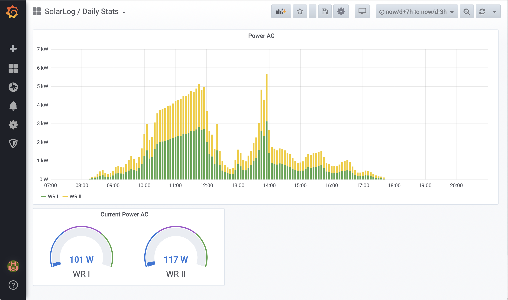

# yasdi2mqtt
`yasdi2mqtt` is an MQTT adapter for SMA inverters communicating over serial bus. It fetches spot values from attached devices in a fixed interval and publishes them via MQTT in JSON data format. Moreover, it also works with only a fraction of all inverters being online at the same time.



## Setup & Run
There are multiple ways to get `yasdi2mqtt` working. I'd strongly recommend using `docker-compose` or `docker` for setup. If you encounter any problems, feel free to open an issue!

### Approach I: docker-compose
1. Check if `yasdi.ini` file fits your needs
    * Especially the serial adapter mountpoint (`Device` parameter) might differ across systems
2. Edit `docker-compose.yml`
    * Set environmental variables (`environment` section) according to environmental variable reference below
    * Change serial adapter mountpoint in `devices` (if modified in step 1)
3. `$ docker-compose up`
    * Build might take a few minutes
    * After starting up, `yasdi2mqtt` should immediately connect to your MQTT broker
    * Detected devices will be printed to console, nevertheless the first MQTT message might take 1-2 minutes more, since channel list has to be downloaded first
        * Consider setting log level to `DEBUG` if device detection / the first MQTT message takes too much time

### Approach II: docker
1. Check if `yasdi.ini` file fits your needs
    * Especially the serial adapter mountpoint (`Device` parameter) might differ across systems
2. `docker build -t yasdi2mqtt .`
3. Start container with the following command and replace variables according to environmental variable reference list
```
docker run \
   --device /dev/ttyUSB0:/dev/ttyUSB0 \
   -v <project_dir>/devices:/etc/yasdi2mqtt/devices \
   -v <project_dir>/yasdi.ini:/etc/yasdi2mqtt/yasdi.ini:ro \
   -e YASDI_CONFIG="/etc/yasdi2mqtt/yasdi.ini" \
   -e YASDI_DRIVER_ID="0" \
   -e YASDI_MAX_DEVICE_COUNT="1" \
   -e YASDI_UPDATE_INTERVAL="30" \
   -e MQTT_TOPIC_PREFIX="/solar/inverter" \
   -e MQTT_SERVER="example.com" \
   -e MQTT_PORT="1883" \
   -e MQTT_USER="johndoe" \
   -e MQTT_PASSWORD="sEcReT" \
   yasdi2mqtt
```

### Approach III: Manual setup
> Work in progress. Use docker-compose or docker instead.

### Environmental variables
| Variable               | Description                                                                                                                              | Example value             |
|------------------------|------------------------------------------------------------------------------------------------------------------------------------------|---------------------------|
| YASDI_CONFIG           | Path to `yasdi.ini` file (inside container) <br> *Remind to also modify volume mountpoint when changing*                                  | /etc/yasdi2mqtt/yasdi.ini |
| YASDI_DRIVER_ID        | ID of driver declared in `yasdi.ini` to use                                                                                                | 0                         |
| YASDI_MAX_DEVICE_COUNT | Maximum number of devices being online at the same time                                                                                  | 1                         |
| YASDI_UPDATE_INTERVAL  | Time between value update requests in seconds <br> *Value update itself takes some time, so it shouldn't be lower than 15 from my experience* | 30                        |
| MQTT_TOPIC_PREFIX      | MQTT messages will later be published to topic `$MQTT_TOPIC_PREFIX/<device_sn>`                                                            | solar/inverter            |
| MQTT_SERVER            |                                                                                                                                          | example.com               |
| MQTT_PORT              |                                                                                                                                          | 1883                      |
| MQTT_USER              | *Optional*                                                                                | johndoe                   |
| MQTT_PASSWORD          | *Optional*                                                                                | sEcReT                    |
| LOG_LEVEL          | *Optional*<br><br>Set `0` to enable debug output                                                                                | 0                    |

## Output format
`yasdi2mqtt` will publish such a json message via mqtt in the given update interval for each connected inverter (channel `$MQTT_TOPIC_PREFIX/<device_sn>`):
```json
{"sn":000,"time":1586608779,"values": {
   "Iac":12580,
   "Uac":239,
   "Fac":50.019998881965876,
   "Pac":3006,
   "Zac":0.17200000816956162,
   "Riso":10000,
   "dI":4,
   "Upv-Ist":416,
   "PPV":3013,
   "E-Total":45358.538154414855,
   "h-Total":47797.772832013434,
   "h-On":51654.766385075491,
   "Netz-Ein":9012,
   "Seriennummer":000,
   "E-Total DC":45694.108978657052,
   "Status":"Mpp",
   "Fehler":"-------"
}}
```
